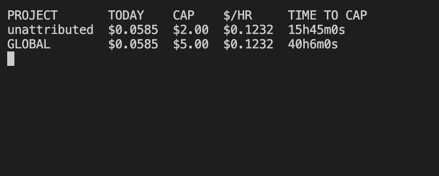

# meter

A local proxy that caps and attributes your LLM API spend. Point your
Anthropic or OpenAI base URL at it and get per-project cost tracking, a
hard daily limit that actually stops requests, and a ranked list of your
most expensive calls, without touching a single call site.



## The problem

Running LLM calls from several places (a terminal agent, a couple of side
projects, ad-hoc scripts) means they all bill to the same provider account.
The provider dashboard shows one number for the day; it cannot tell you
that one project burned 70% of it. Provider limits are monthly and
enforced after the fact by email. When a day costs 6x what it should,
there is no way to find out which single request did it.

meter sits between your SDK and the real API as a transparent reverse
proxy, so none of that changes except where the request goes.

## Install

```sh
go install github.com/vaish725/tokenmeter/cmd/meter@latest
```

Or build the Docker image locally:

```sh
docker build -t meter .
docker run -d \
  -p 8080:8080 -p 8081:8081 \
  -e METER_LISTEN_ADDR=0.0.0.0:8080 \
  -e METER_OPENAI_LISTEN_ADDR=0.0.0.0:8081 \
  meter
```

(A Homebrew tap and tagged releases are configured in `.goreleaser.yml`
but not yet published.)

## Quick start

```sh
meter                      # starts both listeners using configs/pricing.json and configs/caps.json
export ANTHROPIC_BASE_URL=http://127.0.0.1:8080
export OPENAI_BASE_URL=http://127.0.0.1:8081
```

Every SDK call now goes through meter unmodified. A request is attributed
to a project in this order: an explicit `X-Meter-Project` header, then a
recognized API key (`configs/api_keys.json`), then `unattributed`:

```sh
curl $ANTHROPIC_BASE_URL/v1/messages \
  -H "X-Meter-Project: cognitiveradar" \
  -H "x-api-key: $ANTHROPIC_API_KEY" \
  -d '{"model":"claude-sonnet-5","max_tokens":1024,"messages":[...]}'
```

## Commands

| Command | What it does |
|---|---|
| `meter` | Runs the proxy: an Anthropic-facing listener and an OpenAI-facing listener, on separate ports. |
| `meter top` | The costliest requests in a time window (`--since`, `--limit`). |
| `meter watch` | A live-refreshing dashboard: spend, burn rate, time to cap, per project. |
| `meter export` | Dumps a time window of requests as CSV (`--since`, `--out`), for spreadsheets or another tool's pipeline. |
| `meter version` | Prints the build version. |

## How it works

- **Reserve then reconcile.** Checking "spend so far < cap" is racy under
  concurrency; N requests in flight can all pass the check before any of
  them finish. meter estimates a pessimistic cost before forwarding a
  request and reserves it against the budget atomically, then reconciles
  the estimate against the real token usage once the response is known.
- **Streaming without buffering.** Responses are relayed byte for byte as
  they arrive; usage is pulled out of the tail of the stream by a small
  incremental scanner, not by buffering the whole response first.
- **Hard caps by default.** A project or the whole account over its daily
  cap gets a structured `429` explaining which cap, what the limit is, and
  when it resets. An opt-in downshift policy (`configs/downshift.json`) can
  retry a cheaper model instead of blocking; without that file, behavior is
  unchanged.
- **Two ports, one process.** `ANTHROPIC_BASE_URL` and `OPENAI_BASE_URL`
  could point at the same port, but both APIs expose overlapping paths
  (`/v1/models`), so a single listener cannot tell an unmatched request's
  provider apart. Separate ports sidestep that.

Every field above comes straight out of the local SQLite database - no
telemetry, nothing phoned home. Real captured traffic, including a run of
requests hitting a per-project cap (`status 429`) before a config change
raised it:


## Configuration

All four files are plain JSON, live in `configs/`, and can be edited
without a rebuild:

- `pricing.json` - USD per million tokens, per model, plus an optional
  `default_price` fallback used for any model not explicitly listed. That
  fallback matters: without it, a model missing from this file costs $0 and
  never counts against your cap - a new model release or a typo in a model
  name would otherwise bypass the daily limit entirely. Reconciliation
  against real `usage` bounds the error even if a price goes stale.
- `caps.json` - a global daily cap and a default per-project cap, with
  optional per-project overrides. Resets at local midnight.
- `downshift.json` - optional, absent by default. Maps a model to a
  cheaper substitute to try before returning a `429`.
- `api_keys.json` - optional, absent by default. Maps the **last 8
  characters** of an API key to a project, for clients that can't send a
  custom header. Only the suffix, never the full key: that's enough
  entropy to tell apart a personal set of keys without this file ever
  being a second copy of anything usable to authenticate as you if it
  leaked. Shape: `{"projects": {"<last 8 chars>": "project-name"}}`.

Paths and ports are all overridable by environment variable; see
`internal/config/config.go` for the full list and defaults. Two more,
opt-in and off by default:

- `METER_CAPTURE_PROMPTS` - set to `true` to store each request's raw
  prompt body alongside its request record, for later inspection. Off by
  default (see [Non-goals](#non-goals)); each captured body is truncated
  to `METER_CAPTURE_PROMPTS_MAX_BYTES` (default 51200, 50KB).
- `METER_METRICS_LISTEN_ADDR` - where the Prometheus `/metrics` endpoint
  binds (default `127.0.0.1:9090`).

## Exporting and monitoring

- **CSV.** `meter export --since 24h > spend.csv` dumps every request in
  the window, one row per call.
- **Prometheus.** `/metrics` on `METER_METRICS_LISTEN_ADDR` serves
  `meter_requests_total{project,provider,model,status}`,
  `meter_cost_usd_total{project,provider}`, and
  `meter_tokens_total{project,provider,direction}`, computed fresh from
  SQLite on every scrape - counters stay accurate across a restart since
  they're not held in process memory.
- **Cost anomaly detection.** Always on, no config needed. Every 10
  minutes, meter compares each active project's spend so far this hour
  against its own trailing 7-day p95-by-hour and logs a warning if the
  current hour is already above it. This only ever logs; it never blocks
  or alters a request, so unlike downshift or capture there's no reason
  to gate it behind an opt-in flag. A project with no meaningful trailing
  history yet is never flagged, so a brand-new project's first hour of
  traffic doesn't trip a false alarm.

## Performance

A local benchmark comparing a direct call to the same call through meter
(non-streaming, loopback, in-process fake upstream):

```
BenchmarkDirectRequest    30.1 µs/op
BenchmarkProxyRequest    280.3 µs/op
```

About 250µs of added overhead per request, well inside the PRD's 20ms p95
budget. Reproduce with `go test ./internal/proxy -bench . -benchmem`.

## Non-goals

Multi-tenant or multi-user support, prompt/response caching, being a
router or load balancer across providers, a hosted service, and storing
prompt bodies by default. This is a single binary for a single developer
on one machine, not a team gateway.

## Development

```sh
go build ./...
go vet ./...
go test ./... -race
go test ./internal/proxy -fuzz=FuzzFeedSSE -fuzztime=30s
```

CI runs gofmt, vet, build, and the full test suite under `-race` on every
push and pull request.

## License

MIT, see [LICENSE](LICENSE).
